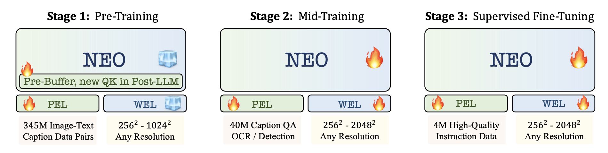

# VTCNativeEval: A Structured Study of Visual Token Compression Methods for Native VLMs

## Project Proposal

### Current benchmark/evaluation

[Arxiv 2025] [UniPruneBench](https://arxiv.org/abs/2511.02650):

1. underrated baseline: *"Random pruning remains a surprisingly strong baseline."*
2. no consistent winner: *"No single method achieves universal superiority."*

[ACL 2026] [VTC-Bench](https://aclanthology.org/2026.acl-long.195): 

1. filter "too hard" questions: *"drop out the samples answered incorrectly at the original resolution, which we consider are too hard for the original models to understand."* 
2. decouple "hard" and "easy" questions: *Difficult Samples (Group A): Samples that are answered incorrectly by the downsampling method* and vice versa.

**🍊🍊🍊Limitations of current evaluation/benchmarking** - no evaluation on Native VLMs (i.e., encoder-free VLMs). We can focus on NEO model from [https://arxiv.org/pdf/2510.14979](https://arxiv.org/pdf/2510.14979):




## Environment Setup

We closely follow the setup from [NEO repository](https://github.com/EvolvingLMMs-Lab/NEO/blob/main/VLMEvalKit/docs/en/Quickstart.md) to set up the environment:

```bash
module load miniconda3/24.1.2-py310
conda create -n neo pip python=3.10
conda activate neo
cd VLMEvalKit
python -m pip install -e .
python -m pip install transformers==4.57.1
```

## VLM Evaluation

We can run one-liner evaluation:

```bash
salloc --nodes=1 --ntasks-per-node=1 --gpus-per-node=1 -A PAS2836 --partition debug-nextgen --time 00:10:00
module load miniconda3/24.1.2-py310
conda activate neo
cd VLMEvalKit
export LMUData=/fs/scratch/PAS2836/yusenpeng_dataset/VLMEvalKit_data
# MMBench
python run.py --data MMBench_DEV_EN --model NEO-2B-SFT --verbose
# MME
python run.py --data MME --model NEO-2B-SFT --verbose
# MMMU
python run.py --data MMMU_DEV_VAL --model NEO-2B-SFT --verbose
# RealWorldQA
python run.py --data RealWorldQA --model NEO-2B-SFT --verbose
# TextVQA
python run.py --data TextVQA_VAL --model NEO-2B-SFT --verbose
# DocVQA
python run.py --data DocVQA_VAL --model NEO-2B-SFT --verbose
# OCRBench
python run.py --data OCRBench --model NEO-2B-SFT --verbose
# ChartQA
python run.py --data ChartQA_TEST --model NEO-2B-SFT --verbose
```

We update the results on Overleaf: [VTC-Native-Eval](https://www.overleaf.com/read/wjvqxyygyjpn#73895d)

## VTC method integration guide

This is a **very detailed** guide on how to integrate existing VTC methods into our codebase. We take ``fixed pooling`` as an example here.

[difficulty: easy 🟢] First of all, we need to implement a Compressor class for every new VTC method in [VLMEvalKit/vlmeval/vlm/neo/local_models/compressor.py](VLMEvalKit/vlmeval/vlm/neo/local_models/compressor.py). Note that it should inherit the abstract class ``BaseVTCCompressor``. We need to at least implement the **init** and **forward** functions. Example of fixed pooling:

```python
class FixedPoolingCompressor(BaseVTCCompressor):
    """Fixed 1D pooling."""

    def __init__(self, compression_ratio: float = 1.0):
        super().__init__(compression_ratio)

        self.pooling_factor = int(round(1.0 / compression_ratio))

        if self.pooling_factor < 1:
            raise ValueError(f"Invalid compression ratio: {compression_ratio}")
        self.null_group = nn.Parameter(torch.zeros(1, 1, 1), requires_grad=False)

    def forward(self, x: torch.Tensor) -> torch.Tensor:
        # [B, H, W, D] -> [B, N, D]
        x = self._flatten_tokens(x)
        if self.pooling_factor == 1:
            return x

        B, N, D = x.shape
        boundaries = torch.zeros(B, N, device=x.device, dtype=x.dtype) # [B, N]

        boundaries[:, self.pooling_factor - 1::self.pooling_factor] = 1.0
        # required: always close the final segment
        boundaries[:, -1] = 1.0

        hidden = x.transpose(0, 1) # [N, B, D]
        null_group = torch.zeros(1, B, D, device=x.device, dtype=x.dtype) # [1, B, D]
        compressed = downsample(boundaries=boundaries, hidden=hidden, null_group=null_group) # [S, B, D]
        compressed = compressed.transpose(0, 1) # [B, S, D]
        return compressed
```

[difficulty: easy 🟢] First, please go to [VLMEvalKit/vlmeval/vlm/neo/local_models/modeling_neo_vit.py](VLMEvalKit/vlmeval/vlm/neo/local_models/modeling_neo_vit.py). We need to make changes to the ``NEOVisionEmbeddings`` class here. In the **init** function, we need to instantiate and initialize our VTC compressor - example of fixed pooling:

```python
class NEOVisionEmbeddings(nn.Module):
    def __init__(self, config: NEOVisionConfig):
        super().__init__()
        self.config = config
        self.embed_dim = config.hidden_size

        # omitted details here..

        if self.vtc_method == "fixed":
            self.compressor = FixedPoolingCompressor(compression_ratio=self.compression_ratio)
        elif self.vtc_method == "none":
            self.compressor = None
        # you should add more here
        else:
            raise ValueError(f"Unknown VTC method: {self.vtc_method}")
```


The next step is to wire up the **language model** itself. Go to file [VLMEvalKit/vlmeval/vlm/neo/local_models/modeling_neo_chat.py](VLMEvalKit/vlmeval/vlm/neo/local_models/modeling_neo_chat.py). We need to update the ``NEOChatModel`` class. There are a total of three pieces to modify for training-free methods, and one additional step for training-based methods.

1. [difficulty: easy 🟢] In the **init** function, we can set some handy instance variables if we want:


```python
class NEOChatModel(PreTrainedModel):
    config_class = NEOChatConfig
    main_input_name = 'pixel_values'

    # omitted details here..

    if self.vtc_method == "none":
        self.pooling_factor = 1
    elif self.vtc_method == "fixed":
        self.pooling_factor = int(round(1.0 / self.compression_ratio))
    else:
        raise ValueError(f"Unsupported vtc_method: {self.vtc_method}")
```

2. [difficulty: easy 🟢] In ``_get_num_visual_tokens`` function, we need to return the correct number of compressed image tokens. Here is an example for fixed pooling:

```python
def _get_num_visual_tokens(self, h, w):
    h_native = int(h) // int(1 / self.downsample_ratio)
    w_native = int(w) // int(1 / self.downsample_ratio)
    num_tokens = h_native * w_native

    if self.vtc_method == "fixed":
        num_tokens = (num_tokens + self.pooling_factor - 1) // self.pooling_factor
    return num_tokens
```

3. [difficulty: medium 🟡] In ``_get_compressed_visual_positions`` function, we need to resolve the image position information after we compress them. Note that this is a **non-trivial function**, which requires a lot of design efforts. An example can be fixed pooling, where we can easily use the final token in each pooling segment (like the position of x4 in [x1, x2, x3, x4]) as the representative position:

```python
def _get_compressed_visual_positions(self, grid_hw, device):
    """Build h/w position indices matching the visual tokens."""
    downsample_factor = int(1 / self.downsample_ratio)
    all_h = []
    all_w = []
    for i in range(grid_hw.shape[0]):
        h = int(grid_hw[i, 0].item()) // downsample_factor
        w = int(grid_hw[i, 1].item()) // downsample_factor

        # Native NEO positions in row-major order
        y, x = torch.meshgrid(
            torch.arange(h, device=device),
            torch.arange(w, device=device),
            indexing="ij",
        )

        pos_h = y.reshape(-1)
        pos_w = x.reshape(-1)

        if self.vtc_method == "fixed":
            # For fixed 1D pooling: 
            # use the final token in each pooling segment as the representative position.
            N = pos_h.numel()
            # Last token of every full pooling group
            idx = torch.arange(self.pooling_factor - 1, N, self.pooling_factor, device=device)
            # If there is an incomplete final group, its final token is also a representative.
            if idx.numel() == 0 or idx[-1].item() != N - 1:
                idx = torch.cat([idx, torch.tensor([N - 1], device=device, dtype=idx.dtype)])
            pos_h = pos_h[idx]
            pos_w = pos_w[idx]
        all_h.append(pos_h)
        all_w.append(pos_w)

    return torch.cat(all_w), torch.cat(all_h)
```

4. [difficulty: hard 🔴] (**This step is only required for training-based methods**) We also have to first remove unused IMG_CONTEXT positions from the training sequence such that the LLM sequence matches the compressed visual tokens. This also involves updating sequence boundaries before slicing, as well as slicing every sequence-aligned tensor. An example of handling fixed pooling:

```python
def _compress_training_sequence(self, input_ids, labels, indexes, loss_weight, seq_boundaries):
    """
        Remove unused IMG_CONTEXT positions from the training sequence 
        such that the LLM sequence matches the compressed visual tokens.
    """
    if self.vtc_method == "none":
        return input_ids, labels, indexes, loss_weight, seq_boundaries
    elif self.vtc_method == "fixed":
        ids = input_ids[0]
        S = ids.shape[0]
        keep_mask = torch.ones(S, dtype=torch.bool, device=ids.device)
        is_img = ids == self.img_context_token_id

        # Find contiguous IMG_CONTEXT runs, where each run corresponds to one image.
        padded = F.pad(is_img.long(), (1, 1), value=0)
        diff = padded[1:] - padded[:-1]
        starts = torch.where(diff == 1)[0]
        ends = torch.where(diff == -1)[0]  # exclusive
        assert len(starts) == len(ends)
        for start, end in zip(starts.tolist(), ends.tolist()):
            N = end - start
            # we can start by dropping all image-token positions 
            keep_mask[start:end] = False

            # NOTE: Keep the exact representatives corresponding to fixed pooling:
            # last token of every pooling group.
            local_idx = torch.arange(self.pooling_factor - 1, N, self.pooling_factor, device=ids.device)

            # Preserve final partial group properly
            if local_idx.numel() == 0 or local_idx[-1].item() != N - 1:
                local_idx = torch.cat([local_idx, torch.tensor([N - 1], device=ids.device, dtype=torch.long,)])
            keep_mask[start + local_idx] = True

        # Update sequence boundaries before slicing.
        # Each old boundary b maps to number of retained tokens before b
        old_boundaries = seq_boundaries
        # Count how many tokens survive before each original sequence position.
        num_kept_before_position = torch.cat([torch.zeros(1, device=ids.device, dtype=torch.long), keep_mask.long().cumsum(0),])
        seq_boundaries = num_kept_before_position[old_boundaries.long()]

        # Slice every sequence-aligned tensor
        input_ids = input_ids[:, keep_mask]
        if labels is not None:
            labels = labels[keep_mask] if labels.dim() == 1 else labels[:, keep_mask]
        if indexes is not None:
            indexes = indexes[keep_mask]
        if loss_weight is not None:
            if isinstance(loss_weight, list):
                loss_weight = torch.as_tensor(loss_weight, device=keep_mask.device)
            loss_weight = loss_weight[keep_mask] if loss_weight.dim() == 1 else loss_weight[:, keep_mask]
        return input_ids, labels, indexes, loss_weight, seq_boundaries
```

For now, congratulations! All the heavylifting work should be done. We simply need a final touch - register and model in our model zoo. Go to [VLMEvalKit/vlmeval/config.py](VLMEvalKit/vlmeval/config.py) and update our neo_series dictionary. For example, we can add a fixed pooling with 25% compression rate like this:

```python
neo_series = {
    "NEO-2B-SFT": partial(
        NEOChat, model_path="Paranioar/NEO1_0-2B-SFT", 
        patch_size=16,
        min_pixels=1280 * 32 * 32,
        max_pixels=4096 * 32 * 32,
        downsample_ratio=0.5,
    ),
    "NEO-2B-SFT-Fixed-4x": partial(
        NEOChat,
        model_path="Paranioar/NEO1_0-2B-SFT",
        patch_size=16,
        min_pixels=1280 * 32 * 32,
        max_pixels=4096 * 32 * 32,
        downsample_ratio=0.5,
        vtc_method="fixed",
        compression_ratio=0.25,
    ),
    # ... more
}
```

Now we can finally start running evaluations and call it a day!

```bash
python run.py --data MME --model NEO-2B-SFT-Fixed-4x --verbose
```

## Continual SFT

mid-training checkpoint: [Paranioar/NEO1_0-2B-MT](https://huggingface.co/Paranioar/NEO1_0-2B-MT) for 2B, [Paranioar/NEO1_0-9B-MT](https://huggingface.co/Paranioar/NEO1_0-9B-MT) for 9B

SFT checkpoint: [Paranioar/NEO1_0-2B-SFT](https://huggingface.co/Paranioar/NEO1_0-2B-SFT) for 2B, [Paranioar/NEO1_0-9B-SFT](https://huggingface.co/Paranioar/NEO1_0-9B-SFT) for 9B.

Let's get started with training! We need to first configure [VLMEvalKit/vlmeval/VLMTrainKit/SFT.sh](VLMEvalKit/vlmeval/VLMTrainKit/SFT.sh). We obviously have to set the job names and output files in SBATCH:

```bash
#SBATCH --job-name=NEO_continue_SFT_5pa
#SBATCH --output=NEO_continue_SFT_5pa.log
```

also update the ``runname``, since this specifies where the model checkpoints are being saved to!

```bash
run_name="NEO_continue_SFT_5pa"
output_dir="/fs/scratch/PAS2836/yusenpeng_checkpoint/VTC-Native-Eval-ckpts/output/${run_name}"
```
Finally, let's configure VTC methods and compression ratio. For original uncompressed NEO, it would look like this:

```bash
args=(
    --model_name_or_path "${mllm}"
    --tokenizer_name_or_path "${mllm}"
    --dataset_use "${datasets}"
    --data_flatten True
    --bf16 True
    --output_dir "${output_dir}"
    --extra_num_layers 12
    --num_hidden_layers 40
    --num_train_epochs 1
    --per_device_train_batch_size "${batch_size}"
    --per_device_eval_batch_size "${batch_size}"
    --gradient_accumulation_steps "${grad_accum_steps}"
    --max_pixels 4194304
    --min_pixels 1310720
    --eval_strategy "no"
    --save_strategy "steps"
    --save_steps 100
    --save_total_limit 6
    --learning_rate "${lr}"
    --weight_decay 0.0
    --warmup_steps 10
    --max_grad_norm 1
    --logging_steps 1
    --max_seq_length 18432
    --model_max_length 18432
    --gradient_checkpointing True
    --dataloader_num_workers 4
    --run_name "${run_name}"
    --report_to none
    --vtc_method none
    --compression_ratio 1.0
)
```

Really two things need to change/update here: ``vtc_method`` and ``compression_ratio``. For fixed pooling under 4x, we can simply do:

```bash
args=(
    ...
    --vtc_method fixed
    --compression_ratio 0.25
)
```

And finally we can run the training experiment with LoRA:

```bash
sbatch VLMEvalKit/vlmeval/VLMTrainKit/SFT.sh
```


## Mid-training and SFT datasets

The NEO author's suggestion: *"We do not currently have an open-source plan. Most of the data is open source. We recommend using the mid-training and SFT data from LLaVA-OneVision-1.5, which our lab has recently open-sourced."*

Mid-training data from LLaVA-OV-1.5: [mvp-lab/LLaVA-OneVision-1.5-Mid-Training-85M](https://huggingface.co/datasets/mvp-lab/LLaVA-OneVision-1.5-Mid-Training-85M)

SFT data from LLaVA-OV-1.5: [mvp-lab/LLaVA-OneVision-1.5-Instruct-Data](https://huggingface.co/datasets/mvp-lab/LLaVA-OneVision-1.5-Instruct-Data)


